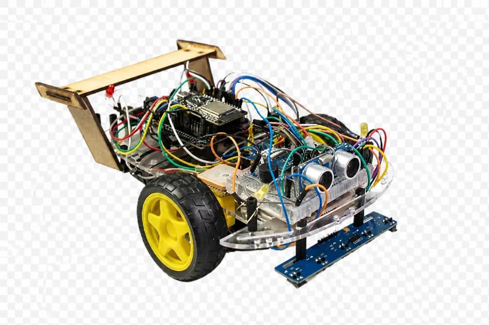

# Smart Car

Vehículo autónomo basado en ESP32, con control web en tiempo real y comunicación mediante MQTT.

El proyecto permite controlar el vehículo de forma manual o utilizar distintos modos autónomos, como seguimiento de línea, evasión de obstáculos y navegación mediante GPS. Es compatible con brokers MQTT locales o públicos y no depende de aplicaciones móviles ni de servicios propietarios.



## Características

- Control manual mediante joystick virtual.
- Luces direccionales y claxon.
- Seguimiento de línea mediante sensores infrarrojos.
- Evasión automática de obstáculos con un sensor HC-SR04.
- Navegación mediante coordenadas GPS.
- Comunicación entre el Control Web y el ESP32 mediante MQTT.
- Compatibilidad con brokers MQTT locales o públicos.
- Control desde un navegador web.

## Arquitectura

El navegador se comunica con el servidor del Control Web mediante WebSockets. El Control Web intercambia comandos y estados con el vehículo a través de un broker MQTT.

```text
┌─────────────────┐
│   Navegador web │
└────────┬────────┘
         │ WebSockets
         ▼
┌─────────────────┐
│   Control Web   │
└────────┬────────┘
         │ MQTT sobre TCP
         ▼
┌─────────────────┐
│   Broker MQTT   │
└────────┬────────┘
         │ MQTT
         ▼
┌─────────────────┐
│   Smart Car     │
│      ESP32      │
└─────────────────┘
```

> El puerto `1883` corresponde normalmente a MQTT sin TLS. Si utilizas otro puerto o una conexión segura, actualiza la configuración del broker y del firmware.

## Modos de operación

| Modo | Descripción |
|:---|:---|
| **Manual** | Control del vehículo mediante un joystick virtual. Incluye dirección, luces direccionales y claxon. |
| **Seguidor de línea** | Navegación autónoma siguiendo una línea mediante un arreglo de sensores infrarrojos. |
| **Evasión de obstáculos** | Detección y evasión automática de obstáculos mediante un sensor HC-SR04. |
| **Navegación GPS** | Navegación hacia unas coordenadas de destino utilizando un módulo GPS. |

## Hardware

| Categoría | Componente | Cantidad |
|:---|:---|:---:|
| **Control** | ESP32 | 1 |
|  | Shield para ESP32 | 1 |
|  | Expansor de entradas/salidas PCF8574 | 1 |
|  | Buzzer pasivo | 1 |
| **Chasis** | Chasis 2WD | 1 |
|  | Motorreductor 1:48, 3,6–6 V | 2 |
|  | Ruedas | 2 |
|  | Rueda loca | 1 |
|  | Discos de encoder | 2 |
|  | Tornillería M3 | — |
| **Motores** | Driver de motores DRV8833 | 1 |
| **Sensores** | Módulo GPS Neo-6M, modelo GY-NEO6MV2 | 1 |
|  | Sensor ultrasónico HC-SR04 | 1 |
|  | Arreglo de sensores TCRT5000 | 1 |
|  | Sensores de encoder FC-03 | 2 |
| **Alimentación** | Baterías 18650 | 2 |
|  | Portabaterías para 18650 | 1 |
|  | Cargador para baterías 18650 | 1 |
|  | Regulador de voltaje LM2596 | 1 |
|  | Capacitor electrolítico de 1000 µF | 1 |
| **Indicadores** | LED rojo | 2 |
|  | LED ámbar | 2 |
|  | Resistencias de 100 Ω | 4 |
| **Conexiones** | Protoboard | 1 |
|  | Cables Dupont | — |

> [!CAUTION]
> Verifica la polaridad, el voltaje de operación y el consumo de cada componente antes de conectarlo. La fuente de alimentación debe ser capaz de entregar la corriente necesaria para el ESP32, los motores y los sensores.

> [!WARNING]
> Utiliza las baterías 18650 con un portabaterías y un cargador adecuados. No mezcles baterías con distinto nivel de carga, capacidad o estado de conservación.

## Dependencias

Las dependencias se instalan automáticamente mediante PlatformIO durante la compilación.

| Librería | Versión |
|:---|:---:|
| [PubSubClient](https://registry.platformio.org/libraries/knolleary/PubSubClient) | — |
| [ArduinoJson](https://registry.platformio.org/libraries/bblanchon/ArduinoJson) | `^7.2.2` |
| [TinyGPSPlus](https://registry.platformio.org/libraries/mikalhart/TinyGPSPlus) | — |
| [PCF8574](https://registry.platformio.org/libraries/robtillaart/PCF8574) | `^0.4.4` |

## Requisitos

Para compilar y cargar el firmware necesitas [PlatformIO CLI](https://platformio.org/install/cli).

## Instalación

### 1. Clonar el repositorio

```bash
git clone https://github.com/rene-nunez/smart-car.git
cd smart-car
```

### 2. Configurar el firmware

Abre [src/config.cpp](./src/config.cpp) y configura las credenciales de la red Wi-Fi y del broker MQTT:

```cpp
const char* ssid = "YOUR_SSID";
const char* password = "YOUR_PASSWORD";
const char* mqtt_server = "BROKER_HOST";
const int mqtt_port = 1883;
```

Reemplaza los valores de ejemplo por los correspondientes a tu instalación:

- `YOUR_SSID`: nombre de la red Wi-Fi.
- `YOUR_PASSWORD`: contraseña de la red Wi-Fi.
- `BROKER_HOST`: dirección IP o nombre de host del broker MQTT.
- `mqtt_port`: puerto del broker MQTT, normalmente `1883`.

El ESP32 y el broker MQTT deben estar conectados a la misma red, salvo que el broker sea accesible desde Internet.

### 3. Compilar y cargar el firmware

```bash
pio run
pio run --target upload
pio device monitor
```

### 4. Instalar el control web

Consulta las instrucciones de instalación y configuración en el [README del control web](./web/README.md).

## Instrucciones de uso

1. Enciende el ESP32 y el resto del hardware.
2. Inicia el broker MQTT.
3. Inicia el Control Web.
4. Abre el Control Web desde un navegador.
5. Comprueba que el indicador MQTT muestre el estado **Conectado**.
6. Selecciona el modo de operación.
7. Utiliza el joystick o los controles disponibles.

## Comunicación MQTT

### Flujo de comunicación

- El control web publica comandos en los tópicos de control.
- El ESP32 se suscribe a los tópicos de control y ejecuta las acciones recibidas.
- El ESP32 publica información de estado.
- El Control web se suscribe a los tópicos de estado.

### Tópicos de control

| Publicador | Suscriptor | Tópico | Payload de ejemplo |
|:---|:---|:---|:---|
| Control web | ESP32 | `smartcar/accion/modo` | `{"modo":"manual"}` |
| Control web | ESP32 | `smartcar/modo/manual` | `{"x":0.5,"y":0.3}` |
| Control web | ESP32 | `smartcar/accion/luces` | `{"tipo":"izq"}` |
| Control web | ESP32 | `smartcar/accion/claxon` | `{"estado":1}` |
| Control web | ESP32 | `smartcar/modo/seguidor` | `{"accion":"activar"}` |
| Control web | ESP32 | `smartcar/modo/obstaculos` | `{"accion":"activar"}` |
| Control web | ESP32 | `smartcar/modo/navegacion` | `{"accion":"iniciar","lat":19.24,"lon":-103.69}` |

### Tópicos de estado

| Publicador | Suscriptor | Tópico | Payload de ejemplo |
|:---|:---|:---|:---|
| ESP32 | Control web | `smartcar/estado/ubicacion` | `{"lat":19.24,"lon":-103.69,"error":40,"sat":4,"destino":true}` |

### Valores permitidos

| Campo | Valores o rango | Descripción |
|:---|:---|:---|
| `modo` | `manual`, `seguidor`, `obstaculos`, `navegacion` | Modo de operación seleccionado. |
| `tipo` | `izq`, `der`, `prev` | Luz direccional o luces preventivas. |
| `accion` | `activar`, `desactivar`, `iniciar`, `detener`, `reanudar` | Acción que debe ejecutar el ESP32. |
| `estado` | `0`, `1` | Desactivado o activado. |
| `x` | `-1.0` a `1.0` | Posición horizontal del joystick. |
| `y` | `-1.0` a `1.0` | Posición vertical del joystick. |
| `lat` | Coordenada decimal | Latitud actual o de destino. |
| `lon` | Coordenada decimal | Longitud actual o de destino. |
| `error` | Distancia en metros | Error estimado respecto al destino. |
| `sat` | Número entero | Número de satélites utilizados por el GPS. |
| `destino` | `true` o `false` | Indica si existe un destino activo. |

## Licencia

Este proyecto se distribuye bajo la licencia MIT. Consulta el fichero [LICENSE](./LICENSE) para obtener más información.
